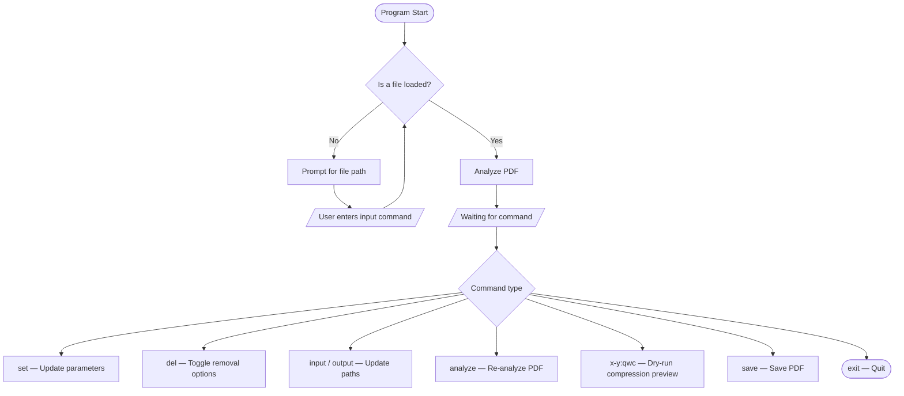
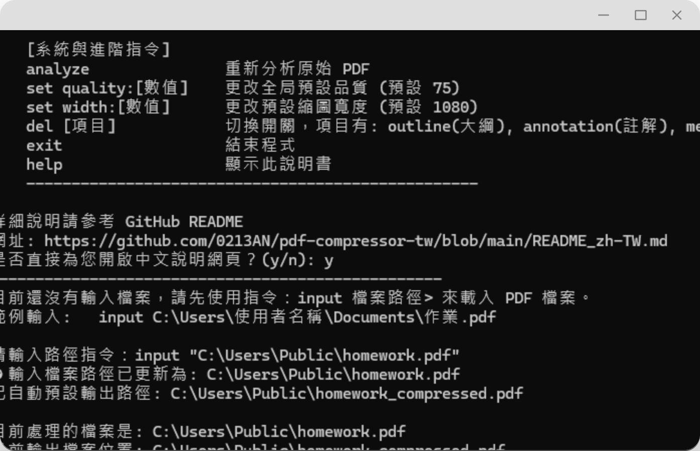
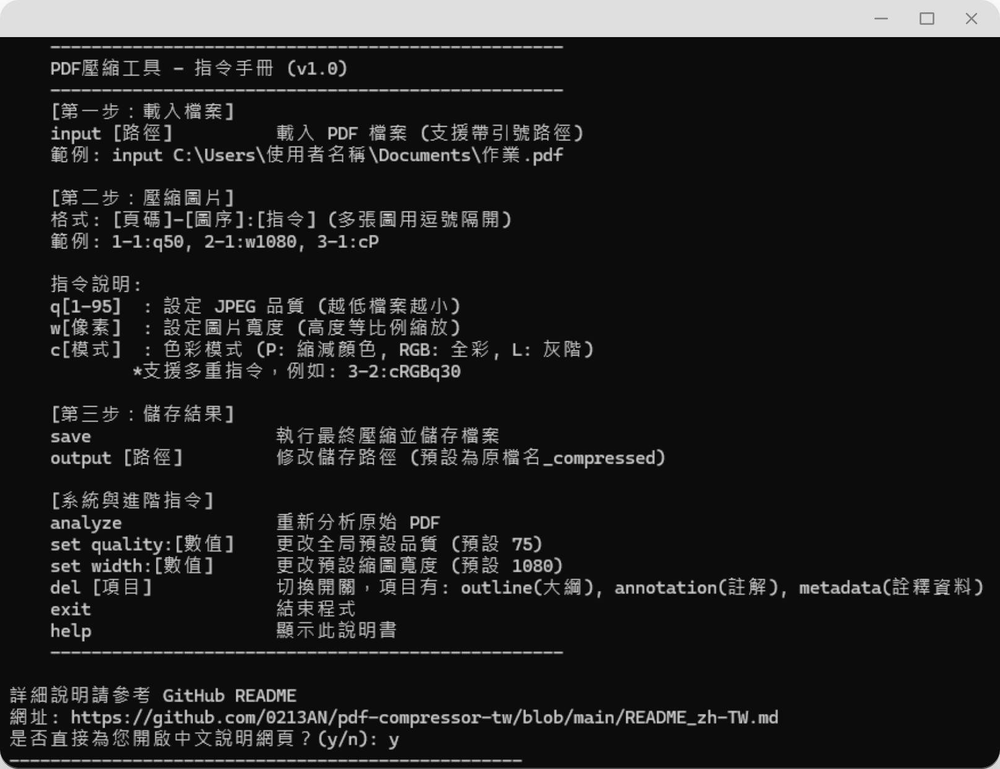
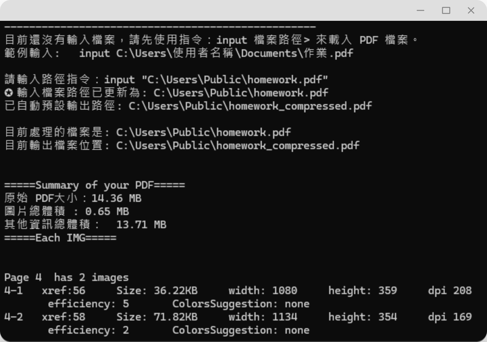
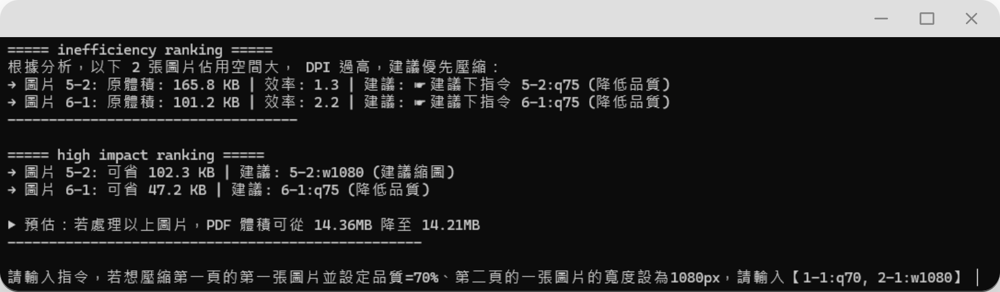

[中文版本](README_zh-TW.md)
# PDF Compressor (for Learning Portfolio)

> A free, open-source CLI tool designed for the 4MB PDF size limit in Taiwan's university application (申請入學) learning portfolio system.
> Most existing tools either cost money or perform poorly on image-heavy PDFs — resulting in severely degraded image quality or broken hyperlinks after compression.
>
> The key feature of this tool is the ability to **preview compression results before saving**, and to **fine-tune compression settings for individual images**.

---

## Requirements

- Python 3.8 or above
- [PyMuPDF](https://pymupdf.readthedocs.io/) (`fitz`)
- [Pillow](https://pillow.readthedocs.io/)

```bash
pip install pymupdf pillow
```

> No Node.js installation required.

---

## Installation

### Method A — Download `.exe` (Windows)
No Python or additional packages needed. Go to the [Releases](https://github.com/0213AN/pdf-compressor-tw/releases) page, download the latest version, and run it directly.

### Method B — Manual source code installation (requires Python, no Git needed)
On GitHub, click **Code > Download ZIP** and extract the archive.
Open a terminal in the extracted folder and run:

```bash
pip install .
```

Once installed, launch the tool by typing:
```
run_compressor
```

### Method C — Install via pip
Make sure [Git](https://git-scm.com/downloads) is installed on your system.
```bash
pip install git+https://github.com/0213AN/pdf-compressor-tw.git
```

Once installed, launch the tool by typing:
```
run_compressor
```

---

## Usage

### Step 1 — Launch the program and load a file

```
python pdf_tool.py
```

After launching, the program will prompt you to enter a file path using the `input` command, for example:
```
input C:\Users\YourName\Documents\portfolio.pdf
```

Once loaded, the program analyzes the PDF and displays four main sections:

| Section Title | Content |
|---|---|
| Summary of your PDF | Total PDF size, total image size, image-to-total ratio |
| Each Img | Size, dimensions, DPI, and efficiency score for each image |
| Inefficient Ranking | Images with high DPI but large file size — recommended for compression |
| High Impact | Images projected to save the most space after compression — highest priority |

<br>

### Step 2 — Compress images

- **`q`** stands for **quality** — adjusts the JPEG compression level for a specific image
- **`w`** stands for **width** — adjusts the image resolution
- **`c`** stands for **color** — changes the color mode (e.g., `cP` reduces the number of colors when an image has too many)

Format: `[page]-[image index on that page]:[command]`, separated by commas for multiple images. Example:
```
1-1:q50, 2-1:w1080, 3-1:cP, 3-2:cRGBq30
```

| Command | Example | Description |
|---|---|---|
| `[id]:q[value]` | `1-1:q50` | Set JPEG quality (1–95); lower values generally mean smaller file size |
| `[id]:w[value]` | `2-1:w1080` | Set image width (px); height is scaled proportionally, also affects DPI |
| `[id]:c[mode]` | `3-1:cP` | Convert color mode |
| Multiple commands | `3-2:cRGBq30` | Multiple options can be applied to the same image |

**Color modes (`c`) reference:**

| Mode | Command | Description |
|---|---|---|
| PNG-8 | `cP` | Up to 256 colors; suitable for charts and diagrams |
| RGB | `cRGB` | Standard full-color JPEG; suitable for photos and detailed visuals |
| Grayscale | `cL` | Black and white mode |

After entering a command, the program runs a **dry-run preview** showing the estimated space savings and asks for confirmation before adding it to the compression queue.

If compression results in a larger file, the command is automatically rejected. Otherwise, new commands override previous ones for the same image.

The compression queue directly determines what gets saved.

<br>

### Step 3 — Save

Type:
```
save
```

The program applies all confirmed commands from the dry-run stage and saves the compressed PDF to the output path.

(Default output path: same folder as the original file, with `_compressed` appended to the filename.)

The output path can be changed using the `output [path]` command.

---
<br>

## Full Command Reference

| Command | Description |
|---|---|
| `input [path]` | Load a PDF file (note the space after `input`) |
| `output [path]` | Set the output path (same note applies) |
| `[id]:qwc` | Compress a specific image (see above) |
| `save` | Write and save the compressed PDF |
| `analyze` | Re-analyze the original PDF |
| `set quality:[value]` | Change default JPEG quality (default: 75) |
| `set width:[value]` | Change default image width (default: 1080) |
| `set dpi:[value]` | Change the DPI threshold for analysis (default: 300) |
| `del outline` | Toggle: remove PDF outline/bookmarks |
| `del annotation` | Toggle: remove annotations |
| `del metadata` | Toggle: remove metadata |
| `exit` | Exit the program |

> `del` commands are enabled by default (outline, annotations, and metadata are removed on save). Each `del` command toggles the option on or off.
>
> Paths after `input` and `output` support quoted formats — pasting paths with surrounding double quotes is fine.

---

## Flowchart



---

## Known Issues & Limitations

1. **Compression may increase file size**

   If an image is already well-compressed, re-encoding it as JPEG may result in a larger file. The dry-run preview will automatically detect and reject such commands.

2. **Dry-run estimates may not be exact**

   The preview uses Pillow to simulate compression, but the final save also goes through `page.replace_image()`, so the actual output size may differ slightly.

3. **Non-image content cannot be compressed**

   This tool is best suited for PDFs where images account for a large portion of the file size. If the analysis report shows that "total image size" is much smaller than "other content size," the PDF's bulk is not coming from images, and compression gains will likely be limited.

4. **Overall compression ratio may be lower than some other tools**

   Compared to tools like PDF24 or LibreOffice's built-in export, this tool may achieve a lower overall compression ratio. Those tools perform more comprehensive processing on the entire PDF beyond just image compression.

---

## Screenshot Examples

<picture>
  <source media="(prefers-color-scheme: dark)" srcset="assets/demo_dark1.png">
  <source media="(prefers-color-scheme: light)" srcset="assets/demo1.png">
  
</picture>

<picture>
  <source media="(prefers-color-scheme: dark)" srcset="assets/demo_dark2.png">
  <source media="(prefers-color-scheme: light)" srcset="assets/demo2.png">
  
</picture>

<picture>
  <source media="(prefers-color-scheme: dark)" srcset="assets/demo_dark3.png">
  <source media="(prefers-color-scheme: light)" srcset="assets/demo3.png">
  
</picture>

<picture>
  <source media="(prefers-color-scheme: dark)" srcset="assets/demo_dark4.png">
  <source media="(prefers-color-scheme: light)" srcset="assets/demo4.png">
  
</picture>

---

## Feedback

If you run into any issues or have suggestions, feel free to leave a note on the [anonymous feedback wall](https://padlet.com/0213an109279/pdf-compressor-p72cjdtfmnaubvh5) — no login required!

---

## License

This project is licensed under the **MIT License**. It was created to help students manage oversized learning portfolio files, and is free for anyone to use, modify, and distribute.

Under the MIT License terms, the original copyright notice (`Copyright 2026 0213AN`) and license text must be retained in any derivative or commercial use of this code. If you find this tool commercially valuable, please respect the original work and credit the source. Plagiarism or claiming it as your own original work is strictly prohibited.
