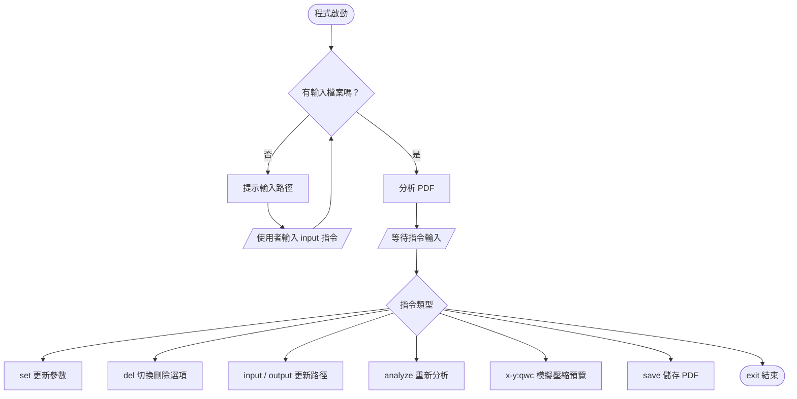

[English Version](README.md)
# PDF 壓縮工具（學習歷程用）

> 免費開源的 CLI 工具，專為申請入學的學習歷程 PDF 4MB 限制設計。  
> 市面上的工具不是要付費，就是對圖片較多的 PDF 效果有限，比如說壓縮後畫質嚴重毀損、超連結失效。
> 
> 這個工具最大特色是能在存檔前先預覽壓縮結果，並且能調整單個圖片的壓縮設定。


---

## 環境需求

- Python 3.8 以上
- [PyMuPDF](https://pymupdf.readthedocs.io/)（`fitz`）
- [Pillow](https://pillow.readthedocs.io/)

```bash
pip install pymupdf pillow
```

> 不需安裝 Node.js

---

## 安裝方式

### 方法 A — 直接用 Python 執行
適合熟悉CLI的使用者。

```bash
git clone https://github.com/0213AN/pdf-compressor-tw.git
cd pdf-compressor-tw
pip install pymupdf pillow
python pdf_tool.py
```

### 方法 B — 下載 `.exe`（Windows）
不需要安裝Python，前往 [Releases](https://github.com/0213AN/pdf-compressor-tw/releases) 頁面下載最新版本，直接執行即可。

### 方法 C — pip 安裝 
```bash
pip install pdf-compressor-tw
```

---

## 使用方式

### 第一步 — 啟動程式並載入檔案

```
python pdf_tool.py
```

程式啟動後會提示你輸入檔案路徑，格式為「input 檔案路徑」，例如:
```
input C:\Users\使用者名稱\Documents\作業.pdf
```

載入後，程式會分析 PDF 並顯示四個大區塊：
| 該區塊標題 | 內容 |
|---|---|
| Summary of your PDF | 整份 PDF 大小、圖片總體積、圖片佔比 |
| Each Img | 每張圖片的大小、尺寸、DPI、效率評分 |
| Inefficient Raking | 低效率排名，DPI 高但體積大的圖片，推薦壓縮 |
| High Impact | 高影響排名，壓縮後預計能省最多空間的圖片，最推薦壓縮 |

<br>

### 第二步 — 壓縮圖片
q 代表 quality，調整它來改決定單一圖片的 JPEG 的壓縮率

w 代表 width，調整它來改變圖片解析度

c 代表 color，調整它來改變色彩模式(比如說圖片顏色太多時，指令cP能減少顏色數量)

格式：`[頁碼]-[那頁的第幾張圖]:[指令]`，多張圖片以逗號隔開。以下為範例。
`1-1:q50, 2-1:w1080, 3-1:cP, 3-2:cRGBq30`

| 指令 | 範例 | 說明 |
|---|---|---|
| `[id]:q[數值]` | `1-1:q50` | 設定 JPEG 品質 (1–95)，通常數值越低檔案越小 |
| `[id]:w[數值]` | `2-1:w1080` | 設定圖片寬度 (px)，高度等比縮放，所以也改變dpi。 |
| `[id]:c[模式]` | `3-1:cP` | 轉換色彩模式 |
|  支援多重指令 | `3-2:cRGBq30` | 可以同一張圖片套用多個選項 |

**色彩模式（`c`）說明：**

| 模式 | 指令 | 說明 |
|---|---|---|
| PNG-8 | `cP` | 最多 256 色，適合圖表、示意圖 |
| RGB | `cRGB` | 標準全彩 JPEG，適合照片、細緻畫面 |
| 灰階 | `cL` | 黑白模式 |

輸入指令後，程式會執行 dry-run 預覽，顯示預計節省的空間，並確認是否加入壓縮清單。

如果壓縮後反而變大，指令會自動被拒絕； 反之，新指令會覆蓋原本的舊指令。

壓縮清單會直接影響儲存結果。

<br>

### 第三步 — 儲存
輸入:
```
save
```
程式會根據之前在dry run階段所儲存的所有最新指令，將壓縮後的 PDF 存到輸出路徑。

（預設輸出路徑：與原始檔案同一資料夾，檔名加上 `_compressed`）

輸出路徑可以使用指令「 output 路徑 」修改。

---
<br>

## 完整指令表

| 指令 | 說明 |
|---|---|
| `input [路徑]` | 載入 PDF 檔案 (input 後面要加空格 ) |
| `output [路徑]` | 指定輸出路徑 (備註同上) |
| `[id]:qwc` | 壓縮指定圖片（見上方說明） |
| `save` | 寫入並儲存壓縮後的 PDF |
| `analyze` | 重新分析原始 PDF |
| `set quality:[數值]` | 更改預設 JPEG 品質（預設75） |
| `set width:[數值]` | 更改預設縮圖寬度（預設1080） |
| `set dpi:[數值]` | 更改 DPI 判斷門檻（預設300） |
| `del outline` | 切換：刪除 PDF 大綱/書籤 |
| `del annotation` | 切換：刪除註解 |
| `del metadata` | 切換：刪除詮釋資料 |
| `exit` | 結束程式 |

> `del` 系列指令預設為開啟（預設輸出時刪除大綱、註解、詮釋資料），每次輸入del指令會切換開關狀態。
> 
> `input`和`output`後的路徑支援帶引號格式，貼上路徑時就算包含雙引號也沒關係
---

## 流程圖



---

## 已知問題與限制

1. **壓縮後體積可能不減反增** 

    如果原始圖片已經壓縮得很好，重新以 JPEG 存檔可能讓檔案變大。dry-run 預覽會自動偵測並拒絕這類指令。

2. **dry-run 預測不完全準確**

    預覽用 Pillow 模擬壓縮，但實際儲存時還會經過 `page.replace_image()` 處理，最終結果可能略有不同。

3. **非圖片內容無法壓縮**

    這個工具比較適合處理圖片體積占比大的檔案，壓縮效果取決於圖片在 PDF 中的佔比。如果分析報表顯示「圖片總體積」遠小於「其他資訊總體積」，代表這份 PDF 的體積主要不是來自圖片，壓縮效果可能會很有限。

4. **壓縮效果不如部分工具** 

    與 PDF24、LibreOffice 內建匯出相比，本工具的整體壓縮率可能較低。這些工具除了壓縮圖片之外，還會對 PDF 整體進行更全面的處理。

---

## 截圖


---

## 授權

本專案採用 MIT License，開發初衷是為了幫助學生解決學習歷程檔案過大的問題，開放所有人自由使用、修改及散佈。

根據 MIT 授權條款，無論後續如何修改或用於商業用途，程式碼中均須保留原始著作權聲明 (Copyright 2026 0213AN) 與授權全文。若您發現本工具有商業價值，請務必尊重原創並標註來源，嚴禁直接剽竊或宣稱為個人原創作品。
